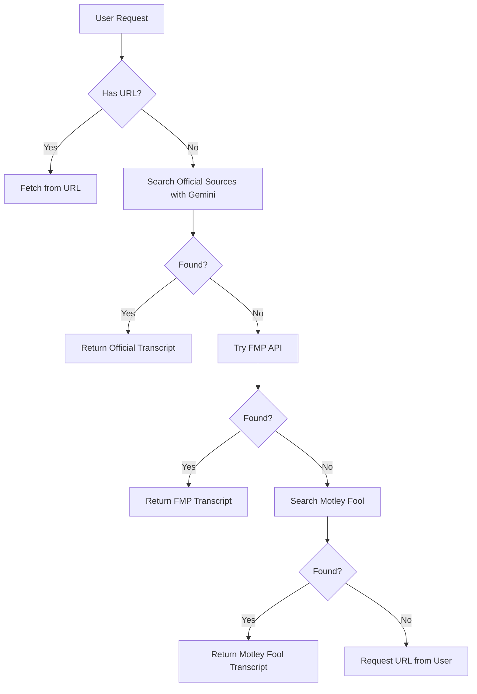

# Enhanced Earnings Call Transcript Agent

A sophisticated multi-source earnings call transcript fetching system with intelligent fallback mechanisms.

## 🚀 Key Features

### Multi-Source Intelligence
The system automatically searches multiple sources in priority order:

1. **Official Company Sources** (via Google Gemini AI)
   - Searches company investor relations pages
   - Checks SEC EDGAR filings
   - Finds official press releases

2. **Financial Modeling Prep API** (Free Tier)
   - Access to comprehensive transcript database
   - 250 free requests per day
   - High-quality structured data

3. **Motley Fool** (Automatic Search)
   - Intelligent search algorithm
   - Automatic content extraction
   - No manual URL needed

4. **User-Provided URLs** (Fallback)
   - Accepts any transcript URL
   - Smart content extraction
   - Works with various formats

## 📋 Prerequisites

- Python 3.8+
- API Keys:
  - Google API Key (for Gemini) - [Get it here](https://makersuite.google.com/app/apikey)
  - Financial Modeling Prep API Key - [Get it here](https://site.financialmodelingprep.com/developer/docs)

## 🛠️ Installation

1. **Clone the repository**
   ```bash
   git clone <your-repo-url>
   cd earnings_call_transcript
   ```

2. **Install dependencies**
   ```bash
   pip install -r requirements.txt
   ```

3. **Set up environment variables**
   ```bash
   cp .env.example .env
   # Edit .env and add your API keys:
   # GOOGLE_API_KEY=your-google-api-key
   # FMP_API_KEY=your-fmp-api-key
   ```

## 🚦 Running the System

Start all three components in separate terminals:

### Terminal 1: Backend API
```bash
python run_backend.py
# Runs on http://localhost:8082
# Handles multi-source transcript fetching
```

### Terminal 2: MCP Server
```bash
python run_mcp.py
# Runs on http://localhost:8081
# Provides tool interface for agents
```

### Terminal 3: A2A Agent (Optional)
```bash
python run_a2a.py
# Runs on http://localhost:8080
# Provides conversational interface
```

## 💬 Using the System

### Via A2A Client (Conversational)
```bash
python src/client/transcript_a2a_client.py
```

Example queries:
- "Get Microsoft's Q4 2023 earnings call"
- "Show me Apple's latest earnings transcript"
- "Find Tesla Q2 2024 earnings"

### Via Direct API
```bash
# Search with natural language
curl -X POST http://localhost:8082/get-transcript \
  -H "Content-Type: application/json" \
  -d '{"company_ticker": "AAPL", "year": 2024, "quarter": 1}'

# Provide direct URL
curl -X POST http://localhost:8082/get-transcript \
  -H "Content-Type: application/json" \
  -d '{"url": "https://www.fool.com/earnings/call-transcripts/..."}'
```

## 🔍 How It Works

### Intelligent Search Flow



### Source Priority
1. **Official sources** are preferred for accuracy and completeness
2. **FMP API** provides reliable structured data
3. **Motley Fool** offers comprehensive coverage
4. **User URLs** ensure you can always get the transcript you need

## 🧪 Testing & Debugging

### Check configured sources
```bash
curl http://localhost:8081/debug/sources
```

### Test all sources for a specific transcript
```bash
curl "http://localhost:8082/debug/test-sources?ticker=AAPL&year=2024&quarter=1"
```

### Health checks
```bash
# Backend health
curl http://localhost:8082/health

# MCP server health
curl http